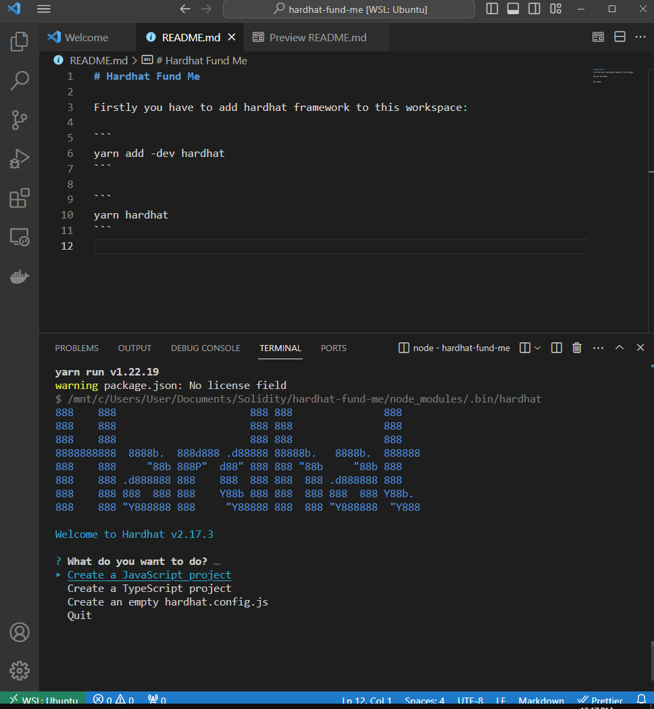

# Hardhat Fund Me

Firstly you have to add hardhat framework to this workspace:

```
yarn add -dev hardhat
```

```
yarn hardhat
```




## Solhint

Solhint is known as solidity linter that we can use to lint our code

Linting is the process of running a program that will analyse code for potential errors

We use ESLint to lint Javascript code

### Solhint Installation:

Install solhint:
```
yarn add solhint
```
Install .solhint.json:
```
yarn solhint --init
```

Update ``.solhint.json``:

```
{
"extends": "solhint:recommended",
    "plugins": [],
    "rules": {
      "avoid-suicide": "error",
      "avoid-sha3": "warn"
    }
}
```
### @chainlink/contracts


Install @chainlink/contracts:
```
yarn add -dev @chainlink/contracts
```

Compile Solidity File:
```
yarn hardhat compile
```
## Deploy

Keeping track of all our deployment can get a little bit tricky
If you just deploy scripts, it's not saving our deployments to any file
Additionally, having everything in the deploy script for deploying can make the tests and the deploy scripts, maybe not work exactly we want


